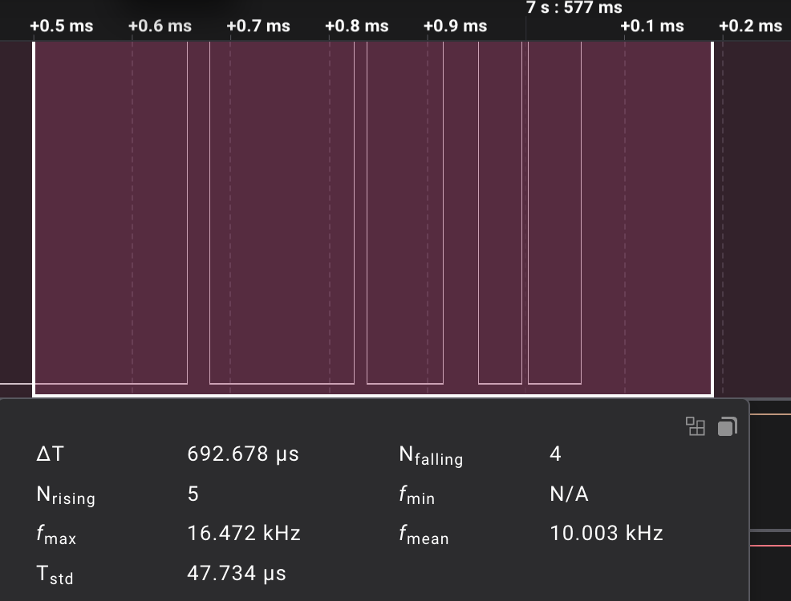
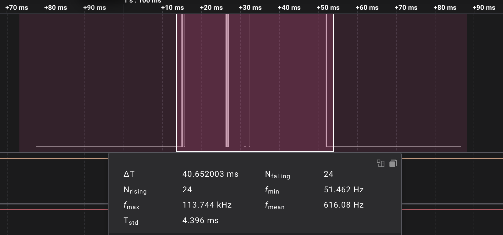

Логічний аналізатор зафіксував 14 імпульсів:

    

Мікроконтролер зафіксував 19:

    

У іншому експерименті спостерігався брязкіт у 4 сигнали довижиною в 700 мікросекунд.

    

Ще в одному експерименті при першому натисканні було зафіксовано 24 зайвих сигнали протягом 41 мс.

    

Згідно з цими еспериментами, має вистачити 45-50 мс дебаунсу.
