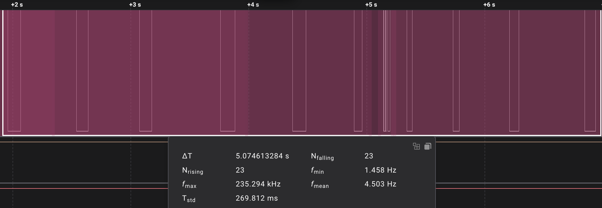
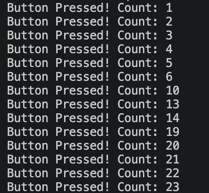
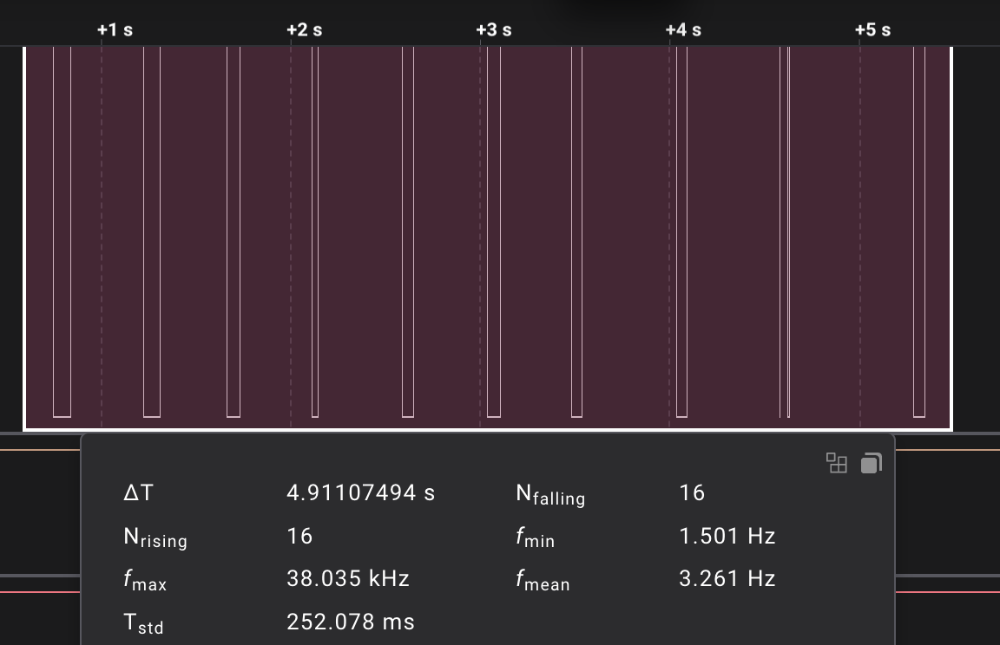
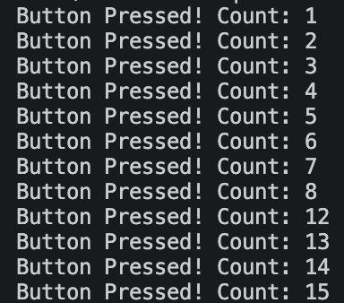

У моєму першому експерименті як логічний аналізатор, так і мікроконтролер зафіксувало сумарно 23 імпульси.

    

    

За результатами логічного аналізатору, брязкіт відбувся під час одного натиснення і створив 13 імпульсів протягом приблизно 62 мс.

У другому експерименті логічний аналізатор зафіксував 16 імпульсів, а мікроконтролер - 15:

    

    

За результатами логічного аналізатору, брязкіт відбувся під час двох натиснень:
* 6 імпульсів протягом ~52 мс
* 2 імпульси протягом ~58 мс

> Чи співпадає кількість імпульсів?

Один раз - так, один раз - ні.

> У яких випадках мікроконтролер «пропускає» частину брязкоту, а коли навпаки — «перерахує зайве»?

Насправді, я не помітив жодної закономірності...

> Яка середня тривалість брязкоту для вашої кнопки?

(62 + 52 + 58) / 3 ~ 58 мс з округленням до найближчого більшого цілого

> Який мінімальний debounce (затримка / логіка фільтрації) був би достатній?

З невеликим запасом можемо взяти 60 мс.
