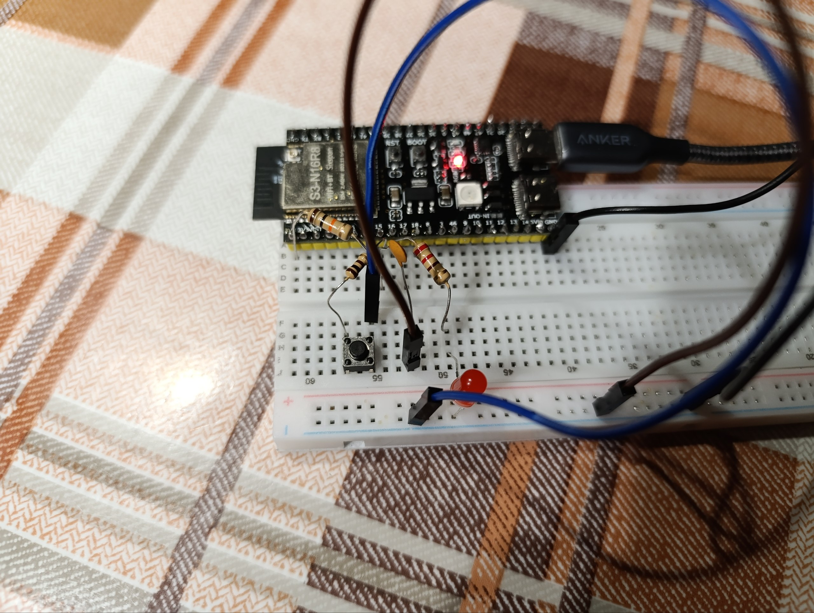
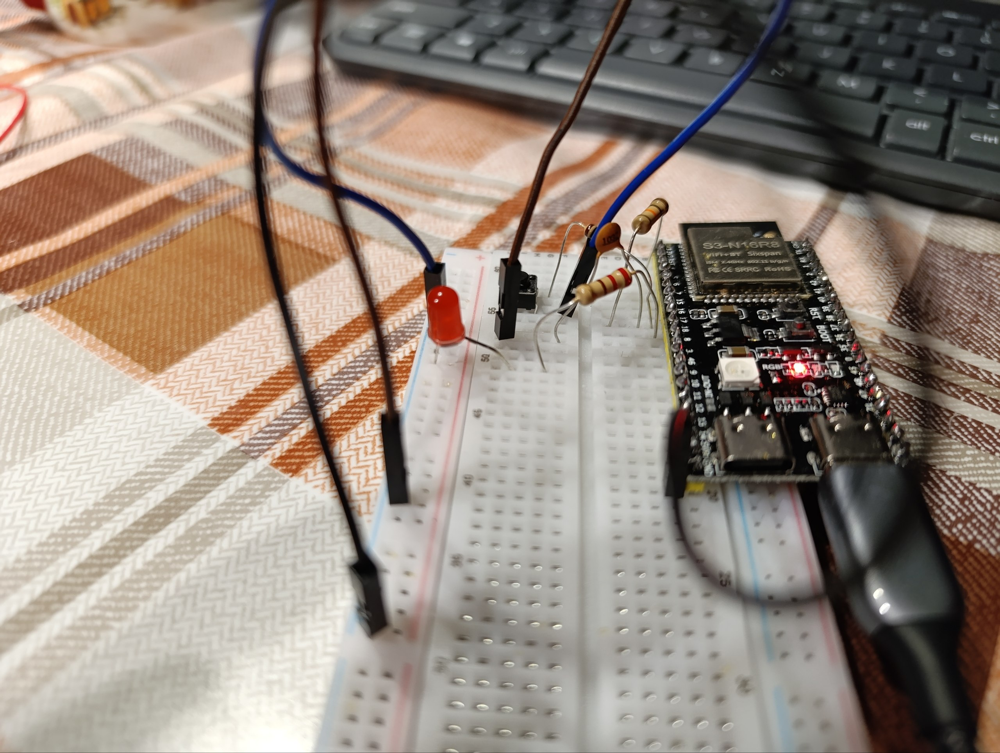

Для кожного метода я зробив 20 натискань.

Можливо, я неправильно зрозумів метод, але у мене в State-based чомусь вийшло більше хибних спрацювань ніж у Time-based.

| Метод | Кількість хибних спрацювань |
| ----- | --------------------------- |
| Без debounce | 5 |
| Time-based   | 2 |
| State-based  | 4 |
| Polling      | 0 |
| Без debounce + RC-фільтр | 10 |
| Time-based + RC-фільтр   | 10 |
| State-based + RC-фільтр  | 4 |
| Polling + RC-фільтр      | 0 |

RC-фільтр реалізований так, що
* пін 15 налаштований як INPUT (з INPUT_PULLUP так само багато хибних спрацювань);
* 3V3 -- 10k резистор -- перший край кнопки
* пін 15 -- 100 Ом резистор -- перший край кнопки
* пін 15 -- 100 нФ конденсатор -- GND
* другий край кнопки -- GND

    

    

