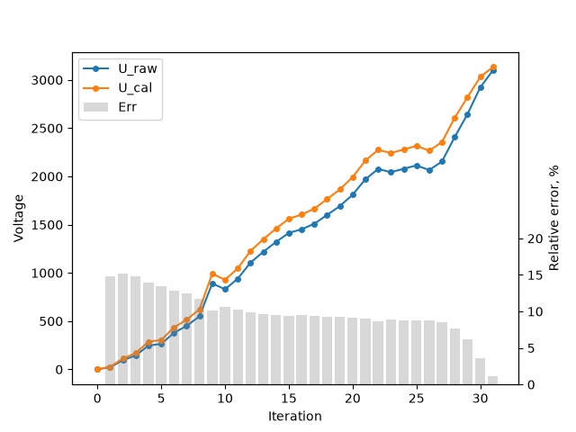

```
RAW   U_manual(mV)   U_cali(mV)   Error(%)
----------------------------------------------
   0              0            0       0.00
  31             23           27      14.81
 126             95          112      15.18
 191            144          169      14.79
 326            246          286      13.99
 349            264          305      13.44
 501            379          435      12.87
 597            451          515      12.43
 727            550          623      11.72
1177            891          992      10.18
1097            830          928      10.56
1243            940         1047      10.22
1463           1107         1228       9.85
1609           1218         1348       9.64
1745           1321         1460       9.52
1868           1414         1561       9.42
1919           1452         1604       9.48
1994           1509         1666       9.42
2115           1601         1765       9.29
2236           1692         1865       9.28
2391           1810         1993       9.18
2603           1970         2164       8.96
2744           2077         2275       8.70
2700           2043         2242       8.88
2747           2079         2279       8.78
2793           2114         2316       8.72
2730           2066         2266       8.83
2846           2154         2356       8.57
3181           2408         2608       7.67
3495           2645         2821       6.24
3860           2922         3031       3.60
4095           3100         3134       1.08
```

